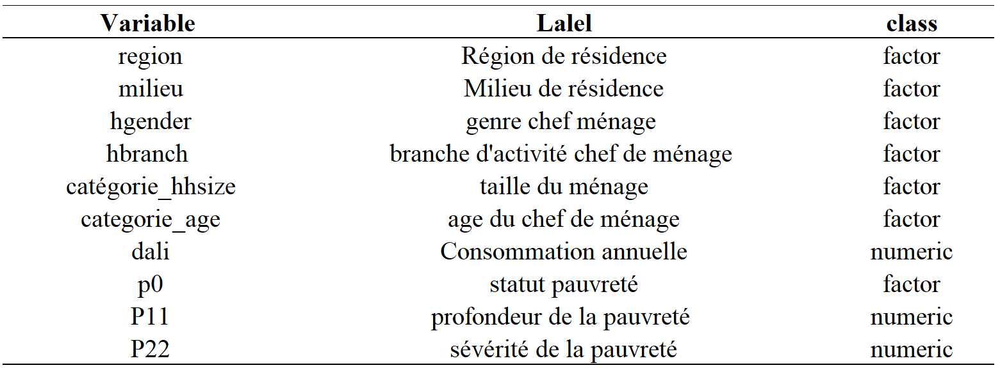
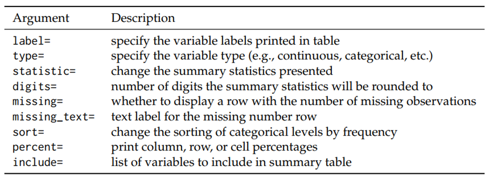
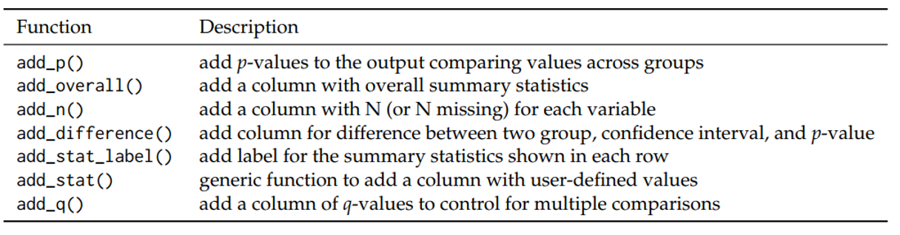

  
```{r setup, include=FALSE, results = 'hide'}
knitr::opts_chunk$set(
  root.dir = here::here(),
	echo = TRUE,
	message = FALSE,
	warning = FALSE
  
)
```

```{r echo=FALSE}
library(car)# pour add_globall_p
library(gtsummary)
library(haven)
library(rstudioapi)
library(knitr)
library(here)## Pour le chemin relatif
library(expss)## Pour la labélisation
library(scales)

```

## Plan 

> - __*Préliminaire*: Utilité, types de variables, données__

> - __*Tableau descriptif univarié* __

> - __*Tableaux croisés *__

> - __*tbl_custom_summary_ *__

> - __*Regression logistique binaire *__

> - __*Résumé *__

# Préliminaires 

## Utilité 

Le package `gtsummary` en R est un outil puissant conçu pour la génération de tableaux de synthèse de données statistiques de manière élégante, personnalisable, reproductible et directement publiables. Il intègre : 

- *Tableaux descriptifs* :  univariés, bivariés et de regression

- *Résumés des données descriptives* : moyennes, médianes, écarts-types, fréquence ...

- *Test statistiques* : t-test, khi-2...

- *Personnalisation avancé* : apparence, titres, légendes, annotations ...

- *Reproductibilité* : Automatisation


## Installation et types de variables  {.build}
### Installation 

- Installer depuis le CRAN : 

```{r eval = FALSE}
  install.packages("gtsummary")
```

- Installer la version de dévellopement depuis github

```{r eval = FALSE}
remotes::install_github("ddsjoberg/gtsummary")
```

### Types de variables 

Il y'a trois types de variables dans gtsummary. Par défaut, gtsummary considère qu'une variable est : 

- __*Dichotomique*__: s’il s’agit d’un vecteur logique (TRUE/FALSE), d’une variable textuelle codée yes/no ou d’une variable numérique codée 0/1.

- __*Catégorielle*__: S'il s'agit d'un facteur, d’une variable textuelle ou d’une variable numérique ayant moins de 10 valeurs différentes.

- __*Continue*__: Dans les autres cas de variables numériques.

## Description de la base de données 


```{r Importation des données, echo=FALSE}
basev <- read_dta("../data/BASE2.dta")
basev <- as_factor(basev)
basev$p0 <- factor(basev$p0, labels = c("non pauvre","pauvre"))
basev<- apply_labels(basev, hgender= "Genre du chef de ménage", 
                     categorie_hhsize="Taille du ménage" )

#write_dta(basev, "basev.dta")
```

```{r echo=F}
#Ramener le format du tableau en français 
theme_gtsummary_language(language = "fr", decimal.mark = ",",
                         big.mark = " ")

```

- __*Source*__ : EHCVM 2018
- __*Taille*__ : 66120 ménages enquêtés et 11 variables 
- __*Description*__ : Les variables renseignent sur la localisation des ménages, les carctérisques sociodémographiques du chef de ménage, la consommation annulle et les indicateurs de pauvreté.  

```{r,  echo=FALSE, fig.width = 5, fig.height= 15}

```


# Tableau descriptif univarié

## Tableeau descriptif univarié { .smaller .scrollable}

<div class = "colon">

<div class = "code_centrer">
```{r results='hide'}

  
tf <- tempfile("example", fileext = ".docx")


  
tbl <- basev %>%
  tbl_summary(include = c(milieu,hgender,dali), 
              missing = "always",
              missing_text = "Nbre observations manquantes",
              sort = all_categorical() ~ "frequency",
              value = list( milieu ~ "Rural", hgender ~ "Masculin"),
              label = list(milieu ~ "Milieu Rural",
                           hgender ~ "Genre Masculin",
                           dali~"Consommation annuelle"),
              statistic = all_continuous() ~ 
                "Moy.:{mean}[min-max:{min}-{max}]",) %>%
              add_n()  %>%
              add_ci() 
  
```

<div class = "div_desc">
- missing : 
- missing_text
- sort
- label
- statistic
</div>

</div>


<div class = "div_tbl">
```{r, echo= F}
basev %>%
  tbl_summary(include = c(milieu,hgender,dali), 
              missing = "always",
              missing_text = "Nbre observations manquantes",
              sort = all_categorical() ~ "frequency",
              value = list( milieu ~ "Rural", hgender ~ "Masculin"),
              label = list(milieu ~ "Milieu Rural",
                           hgender ~ "Genre Masculin",
                           dali~"Consommation annuelle"),
              statistic = all_continuous() ~                                                 "Moy.:{mean}[min-max:{min}-{max}]",) %>%
              add_n()  %>%
              add_ci() 
```
</div>

</div>

# Tableau descriptif bivarié 
## Tableau descriptif bivarié (1/2)

<div class = "colon">

<div class = "code_centrer">
```{r eval=F }
basev %>% tbl_cross(row = categorie_age,
                    col = categorie_hhsize,
                    percent = "cell",
                    label = categorie_age ~ "Age CM" ) %>%

  as_gt()%>%
  gt::tab_header(
    title=gt::md("**Répartition des ménages
                 selon la taille et l'age CM**"))%>%
  gt::tab_source_note("EHCVM, calculs de l'auteur")

```

<div class = "div_desc">
- row
- col 
- percent 
- as_gt()
- tab_header()
- tab_source_note

</div>
</div>
<div class = "div_tbl">
```{r echo=FALSE}
basev %>% tbl_cross(row = categorie_age, col = categorie_hhsize, percent = "cell") %>%
  as_gt()%>%
  gt::tab_header(
    title=gt::md("**Répartition des ménages selon la taille et l'age CM**"))%>%
  gt::tab_source_note("EHCVM, calculs de l'auteur")

```
</div>

</div>

## Tableau descriptif bivarié (2/2)
<div class = "colon">

<div class = "code_centrer" class = "petit">
```{r eval = F}
basev %>%
  tbl_summary(include = c(P11, P22),
    by = hgender,
    label = list(P11 ~ "Profondeur de pauvreté",
                 P22 ~ "Sévérité de la pauvreté"),
    statistic = list(c(P11, P22)~ "{mean}") 
)%>%  add_difference() %>%
  as_gt()%>%
  gt::tab_header(
    title=gt::md("**Profondeur et sévérité de la
                 pauvreté selon le sexe CM**"))%>%
  gt::tab_source_note("EHCVM, calculs de l'auteur")
```

<div class = "div_desc">
- by 
- add_difference()

</div>
</div>
<div class = "div_tbl">
```{r echo=F}
basev %>%
  tbl_summary(include = c(P11, P22),
    by = hgender,
    label = list(P11 ~ "Profondeur de pauvreté",
                 P22 ~ "Sévérité de la pauvreté"),
    statistic = list(c(P11, P22)~ "{mean}") 
)%>%  add_difference() %>%
  as_gt()%>%
  gt::tab_header(
    title=gt::md("**Profondeur et sévérité de la
                 pauvreté selon le sexe CM**"))%>%
  gt::tab_source_note("EHCVM, calculs de l'auteur")
```

</div>

</div>

# tbl_custom_summary
## tbl_custom_summary (1/2)
<div class = "colon">

<div class = "code_centrer">

```{r eval=F, results='hide' , class = "petit"}

my_data <- data.frame(
  milieu = c("Urbain", "Rural"),
  taux = c(0.22, 0.58)
)

## Traduire le dataframe en tableau gt
pauvreté2011<-my_data%>%
  mutate(milieu=factor(milieu, levels=c("Urbain","Rural")))%>%
  tbl_custom_summary(
  include = c(milieu), label = milieu~ "Milieu residence",
  stat_fns = ~continuous_summary("taux"),
  statistic = ~"{mean}",
  digits = ~ list(
      function(x) {
        style_percent(x, digits = 1)
      },
      0, 0, style_percent, style_percent
    ),
  overall_row = TRUE,  ##
  overall_row_last = TRUE
)%>%
  modify_header(stat_0~"**%**")%>%
  modify_footnote(everything()~NA)

## Le tableau de la proportion de pauvres
pauvreté2018<-basev%>%
  tbl_custom_summary(
  include = c(milieu),
  stat_fns = ~proportion_summary(variable="p0"
                                ,value="pauvre"),
  statistic = ~"{prop}",
  digits = ~ list(
      function(x) {
        style_percent(x, digits = 1)
      },
      0, 0, style_percent, style_percent
    ),
  overall_row = TRUE,
  overall_row_last = TRUE
)%>%
  modify_header(stat_0~"**%**")%>%
  modify_footnote(everything()~NA)

## Merger les deux tableaux
tbl_merge(list(pauvreté2011,pauvreté2018),
          tab_spanner = c("Taux de Pauvreté 2011",
                          "Taux de Pauvreté 2018"))%>%
  as_gt()%>%
  gt::tab_header(
    title=gt::md("**Taux de pauvreté selon le milieu**"))%>%
  gt::tab_source_note("EHCVM, calculs de l'auteur")


```
<div class = "div_desc">
- stat_fns
- digits
- overall_row
- overall_row_last
- tbl_merge

</div>
</div>
<div class = "div_tbl">

```{r echo=FALSE}
my_data <- data.frame(
  milieu = c("Urbain", "Rural"),
  taux = c(0.22, 0.58)
)

## Traduire le dataframe en tableau gt
pauvreté2011<-my_data%>%
  mutate(milieu=factor(milieu, levels=c("Urbain","Rural")))%>%
  tbl_custom_summary(
  include = c(milieu), label = milieu~ "Milieu residence",
  stat_fns = ~continuous_summary("taux"),
  statistic = ~"{mean}",
  digits = ~ list(
      function(x) {
        style_percent(x, digits = 1)
      },
      0, 0, style_percent, style_percent
    ),
  overall_row = TRUE,  ##
  overall_row_last = TRUE
)%>%
  modify_header(stat_0~"**%**")%>%
  modify_footnote(everything()~NA) 

## Le tableau de la proportion de pauvres
pauvreté2018<-basev%>%
  tbl_custom_summary(
  include = c(milieu),
  stat_fns = ~proportion_summary(variable="p0",value="pauvre"),
  statistic = ~"{prop}",
  digits = ~ list(
      function(x) {
        style_percent(x, digits = 1)
      },
      0, 0, style_percent, style_percent
    ),
  overall_row = TRUE,
  overall_row_last = TRUE
)%>%
  modify_header(stat_0~"**%**")%>%
  modify_footnote(everything()~NA)

## Merger les deux tableaux
tbl_merge(list(pauvreté2011,pauvreté2018),tab_spanner = c("Taux de Pauvreté 2011","Taux de Pauvreté 2018/2019"))%>%
  as_gt()%>%
  gt::tab_header(
    title=gt::md("**Taux de pauvreté selon le milieu**"))%>%
  gt::tab_source_note("EHCVM, calculs de l'auteur")

```
</div>

</div>

## tbl_custom_summary (2/2)
<div class = "colon">

<div class = "code_centrer">
```{r results='hide',eval=FALSE}
## Pauvreté selon le sexe et la région
basev %>%
  tbl_custom_summary(
    include = "categorie_age",
    label = categorie_age~ "Classe d'âge",
    by = "hgender",
    stat_fns = ~ proportion_summary("p0", "pauvre"),
    statistic = ~"{prop}% ",
    digits = ~ list(
      function(x) {
        style_percent(x, digits = 1)
      },
      0, 0, style_percent, style_percent
    ),
    overall_row = TRUE,   
    overall_row_last = TRUE 
  ) %>%
  bold_labels() %>% 
  modify_footnote(
    update = all_stat_cols() ~ ""
  )%>%
  as_gt()%>%
  gt::tab_header(
    title=gt::md("**Taux de pauvreté selon l'âge et le sexe**"))%>%
  gt::tab_source_note("EHCVM, calculs de l'auteur")


```
<div class = "div_desc">
</div>
</div>
<div class = "div_tbl">
```{r echo=FALSE}
## Pauvreté selon le sexe et la région
basev %>%
  tbl_custom_summary(
    include = "categorie_age",
    label = categorie_age~ "Classe d'âge",
    by = "hgender",
    stat_fns = ~ proportion_summary("p0", "pauvre"),
    statistic = ~"{prop}% ",
    digits = ~ list(
      function(x) {
        style_percent(x, digits = 1)
      },
      0, 0, style_percent, style_percent
    ),
    overall_row = TRUE,   # Ajouter le total
    overall_row_last = TRUE # Positionner le total en bas
  ) %>%
  bold_labels() %>% # mettre en gras les variables
  modify_footnote(
    update = all_stat_cols() ~ ""
  )%>%
  as_gt()%>%
  gt::tab_header(
    title=gt::md("**Taux de pauvreté selon l'âge et le sexe**"))%>%
  gt::tab_source_note("EHCVM, calculs de l'auteur")

```
</div>

</div>

# Regression logistique binaire
## Regression logistique binaire { .smaller .scrollable}
<div class = "colon">

<div class = "code_centrer">
```{r eval=F}
mod <- glm(p0~milieu + hgender + categorie_hhsize,
         data = basev, family = binomial)

tbl_mod_b <- mod%>%
  tbl_regression(exponentiate = TRUE,
                 intercept = TRUE, 
                estimate_fun = scales::label_number(accuracy=.001,
                                              decimal.mark ="," ),
                    pvalue_fun= scales::label_pvalue(accuracy=.001,
                                            decimal.mark=","))%>% 
  modify_header(c(label~"**Variables**",estimate~"**Odds 
                  ratio**",std.error="**standart error**",
                  p.value ~ "*Test de comparaison* (p-valeur)"))%>% 
  modify_footnote(everything()~NA, abbreviation = TRUE)%>%
  add_significance_stars(hide_ci = TRUE, hide_p = FALSE, hide_se = FALSE)%>% 
  bold_labels()%>% 
  italicize_levels()


tbl_desc<-basev%>%tbl_custom_summary(
  include = c(milieu, hgender, categorie_hhsize),
  stat_fns = ~proportion_summary(variable="p0",value="pauvre"),
  statistic = ~"{prop}"
)%>%
  modify_header(stat_0~"**proportion**")%>%
  modify_footnote(everything()~NA)


tbl_merge(list(tbl_desc,tbl_mod_b),
tab_spanner = c("**Statistique descriptive**",
                "**Modèle logit**")) %>%
  as_gt() %>%
  gt::tab_header(
    title=gt::md("**Tableau: Resultat du modèle logistique**"))%>%
  gt::tab_source_note("EHCVM, calculs de l'auteur")
```

<div class = "div_desc">
- glm 
- exponentiate
- intercept
- estimate_fun
- pvalue_fun
- add_significance_stars()
- tbl_merge
- tab_spanner

</div>
</div>
<div class = "div_tbl">
```{r echo=F}
mod<-glm(p0~milieu + hgender + categorie_hhsize, data = basev, family = binomial
         )
tbl_mod_b<-mod%>%tbl_regression(exponentiate = TRUE,intercept = TRUE, 
                     estimate_fun = scales::label_number(accuracy=.001,
                                                         decimal.mark ="," ),
                     pvalue_fun= scales::label_pvalue(accuracy=.001,
                                                      decimal.mark=","))%>% 
  modify_header(c(label~"**Variables**",estimate~"**Odds 
                  ratio**",std.error="**standart error**", 
                  p.value ~ "*Test de comparaison* (p-valeur)"))%>% 
  modify_footnote(everything()~NA, abbreviation = TRUE)%>%
  add_significance_stars(hide_ci = TRUE, hide_p = FALSE, hide_se = FALSE)%>% 
  bold_labels()%>% 
  italicize_levels()

tbl_desc<-basev%>%tbl_custom_summary(
  include = c(milieu, hgender, categorie_hhsize),
  stat_fns = ~proportion_summary(variable="p0",value="pauvre"),
  statistic = ~"{prop}"
)%>%
  modify_header(stat_0~"**proportion**")%>%
  modify_footnote(everything()~NA)

tbl_merge(list(tbl_desc,tbl_mod_b),
tab_spanner = c("**Statistique descriptive**",
                "**Modèle logit**")) %>%
  as_gt() %>%
  gt::tab_header(
    title=gt::md("**Tableau: Resultat du modèle logistique**"))%>%
  gt::tab_source_note("EHCVM, calculs de l'auteur")
```

</div>

</div>

# Résumé
## Résumé 
<div class = "div_tbl">
Les fonctions les plus utilisées sont : 
<br>
- __*tbl_summary*__
```{r,  echo=FALSE, fig.height=5, fig.cap = ""}

```
<br>
- __*add...()*__
```{r,  echo=FALSE, fig.height=5, fig.cap = ""}

```
<br>
- __*format tableau*__
```{r,  echo=FALSE, fig.height=5, fig.cap = ""}
knitr::include_graphics("../img/res_3.png")
```
<br>
- __*Exportation*__ : gt::gtsave , flextable::save_as_docx 
```{r eval=FALSE}
 tableau %>% as_gt() %>%
  gt::gtsave(filename = tbl, path = here::here())

tableau %>% 
  as_flex_table() %>%
  flextable::save_as_docx( 
    path = paste0(here::here(),"/tbl.docx"))
# tableau est un tableau
# tbl est un fichier word 
```


</div>

## Bibliographie et webographie

- *https://www.danieldsjoberg.com/gtsummary-weill-cornell-presentation/#59*

- *https://github.com/ddsjoberg/gtsummary*

- *https://www.danieldsjoberg.com/gtsummary/*

- *Reproducible Summary Tables with the gtsummary Package by Daniel D. Sjoberg, Karissa Whiting, Michael Curry, Jessica A. Lavery, Joseph Larmarange*

- *https://larmarange.github.io/analyse-R/gtsummary.html*


