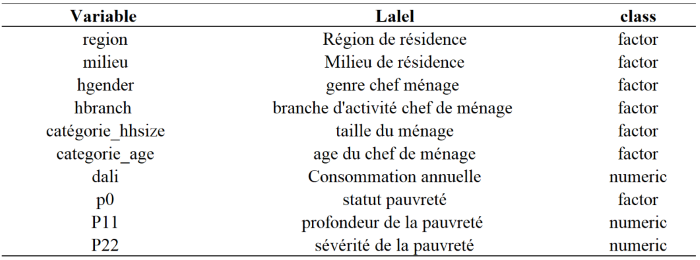

\pagestyle{fancy}
\fancyhf{}
\fancyhead[L]{Projet- logiciel statistique R: Le package gtsumary}
\fancyfoot[C]{ADAM, CISSE, NGOM, KOLAMBIGUE}
\fancyfoot[R]{\thepage}


\maketitle
\includepdf{page_garde}
\newpage
\tableofcontents
\newpage
```{r setup, include=FALSE}
knitr::opts_chunk$set(eval = TRUE,
                      message = FALSE, 
                      warning = FALSE,
                      include  = TRUE,
                      root.dir = here::here())
```


```{r echo=FALSE}
library(car)# pour add_globall_p
library(gtsummary)
library(haven)# package permettant la lecture d'un fichier csv
library(rstudioapi)
library(knitr)
library(here)## Pour le chemin relatif
library(expss)## Pour la labélisation
library(scales)

```

\begin{tcolorbox}[colback=red!5!white,colframe=black,title=Note,sharp corners]
La bibliothèque GTsummary est une puissante extension de R pour la création de tableaux de synthèse des résultats d'analyses statistiques. Son objectif principal est de simplifier et d'améliorer la création de rapports statistiques en fournissant des outils conviviaux pour résumer et présenter les résultats de manière claire et concise.

Pour utiliser gtsumary: Importer les données dans R, Utiliser les fonctions gtsummary pour résumer les resultats des analyses statistiques, personnaliser les tableaux générés selon vos besoins en utilisant les options de personnalisations disponibles, Intégrer les tableaux dans vos rapports ou présentations pour une communication claire et efficace des résultats.


\end{tcolorbox}

# I Préliminaires

## I-1 Utilité 

Le package `gtsummary` en R est un outil puissant conçu pour la génération de tableaux de synthèse de données statistiques de manière élégante, personnalisable, reproductible et directement publiables. Il intègre : 

- **Tableaux descriptifs** :  univariés, bivariés et de regression

- **Résumés des données descriptives** : moyennes, médianes, écarts-types, fréquence ...

- **Test statistiques** : t-test, khi-2...

- **Personnalisation avancé** : apparence, titres, légendes, annotations ...

- **Reproductibilité** : Automatisation


## I-2 Installation et types de variables  
### I-2-1 Installation 

- Installer depuis le CRAN : 

```{r  eval = FALSE}
  install.packages("gtsummary")
```

- Installer la version de dévellopement depuis github

```{r eval = FALSE}
remotes::install_github("ddsjoberg/gtsummary")
```

### I-2-2 Types de variables 

Il y'a trois types de variables dans gtsummary. Par défaut, gtsummary considère qu'une variable est : 

- **Dichotomique** : s’il s’agit d’un vecteur logique (TRUE/FALSE), d’une variable textuelle codée yes/no ou d’une variable numérique codée 0/1.

- **Catégorielle** : S'il s'agit d'un facteur, d’une variable textuelle ou d’une variable numérique ayant moins de 10 valeurs différentes.

- **Continue** : Dans les autres cas de variables numériques.

## I-3 Description de la base de données 


```{r Importation des données, echo=FALSE}

basev <- read_dta("../data/BASE2.dta")
basev <- as_factor(basev)
basev$p0 <- factor(basev$p0, labels = c("non pauvre","pauvre"))
basev<- apply_labels(basev, hgender= "Genre du chef de ménage", 
                     categorie_hhsize="Taille du ménage" )

```

- **Source** : EHCVM 2018
- **Taille** : 66120 ménages enquêtés et 11 variables 
- **Description** : Les variables renseignent sur la localisation des ménages, les carctérisques sociodémographiques du chef de ménage, la consommation annulle et les indicateurs de pauvreté.  

```{r,  echo=FALSE, fig.width = 3, fig.height= 9}

```


# II Tableau descriptif univarié

## II-1 Thémes du tableaux

gtsummary fournit plusieurs fonctions préfixées **theme_gtsummary()** permettent de modifier  l'affichage par défaut des tableaux.
Parmis les Exemples de fonctions nous avons: La fonction **theme_gtsummary_language**(Permets de modifier la langue utlisés dans le tableaux), La fonction **theme_gtsummary_journal**(Pour définir un thème prédéfini), La fonction **reset_gtsummary_theme**(Pour effacer tous les thémes précédemment définis)

```{r echo=TRUE}
#Ramener le format du tableau en français 
theme_gtsummary_language(language = "fr", decimal.mark = ",",
                         big.mark = " ")

```

## II-2 La fonction tbl_summary

La fonction au coeur du package **gtsummary** se nomme **tbl_summary()**.Elle produit un tableau qui s'affiche dans l'onglet "Viewer". On lui passe en entrée un tableaux de données (data.frame) et par défaut toutes les variables sont résumé (base %>%tbl_summary())

La fonction *tbl_summary* permet d'obtenir la statistique descriptive ou tri à plat des variables, c'est-à-dire obtenir la moyenne, l'écart-type, intervalle interquartile, etc.Elle prend au minimum une base de données. Dans ce cas, elle affiche des statistiques descriptives pour chaque variable. 

### II-2-1 Sélection des variables (include)

La paramètre include permets de spécifier les variables à inclure dans le tableau (et leur ordre). On
peut lui passer un vecteur de noms de variables, ou bien utiliser des sélecteurs tidyselect (utiliser c() si
plusieurs sélecteurs).

Par exemple, le tableau suivant nous donne des statistiques descriptives sur les variables **milieu**, **Niveau d'éducation du chef du ménage**, la variable **genre du chef de ménage** 

```{r}
# Appliquer la fonction tbl_summary() à l'ensemble de données 'basev'
basev %>%
  tbl_summary(include = c("milieu","hgender","heduc"),
              
  value = list( milieu ~ "Rural", hgender ~ "Masculin"),
  label = list(milieu ~ "Milieu Rural",hgender ~ "Genre Masculin"))
```

Il important de souligner que les statistiques envoyées par défaut dépendent du type de la variable. Ainsi, pour les variables du type numérique, nous avons un format du type : mediane (intervalle interquartile). Toutefois, il est possible de paramétrer ces arguments par défauts. 

### II-2-2 Etiquettes des variables

Pour modifier l'étiquettes associé à une certaine variable,on peut utliser l'option *label* de *tbl_summary* par exemple:

```{r}
# Résumé tabulaire des statistiques descriptives pour les variables 

'milieu'#, hgender avec une étiquette personnalisée
basev %>%
  tbl_summary(include = c("milieu","hgender", "hbranch"),label = 
                list(milieu~"milieu de naissance du CM", hgender~"genre CM")  )
```

Il est également possible d'utliser la syntaxe *tidyselect* et les selecteurs de *tidyselect* comme *everythings*,*starts_with*,*contains* ou*all_of*.

```{r}
# Résumé tabulaire des statistiques descriptives pour toutes les variables de l'ensemble de données 
'base' #avec une étiquette commune
basev %>%
  tbl_summary(include = c("milieu","hgender","heduc"),label=everything()~"Etiquette")
```

## II-3 Statistiques à afficher 

 on peut définir une liste dans laquelle on indique des formules spécifient les types de statistiques descriptives à afficher pour les variables ,comme suit:
 
```{r}
# Générer un résumé tabulaire des statistiques 
#descriptives pour les variables 'P1' et 'P22' de 
#l'ensemble de données 'basev'
# Spécifier les statistiques à afficher pour les variables P11, P22 
basev %>%
  tbl_summary(
    include = c(P11,P22,dali),  # Sélectionner la variable 'region'
    statistic = all_continuous() ~ "Moy.:{mean}[min-max:{min}-{max}]",
    #Spécifier les statistiques à afficher
 label = list(P11~"pronfondeur de la pauvreté",P22~"Sévérité de la 
              pauvreté", dali~"Consommation annuelle") )

```

Il est possible d'afficher des statistiques différentes pour chaque variable.

```{r}
# Générer un résumé tabulaire des statistiques descriptives pour les 
#variables 'region' et 'milieu' de l'ensemble de données 'base'
# Trier les modalités des variables catégorielles par fréquence,
#de la plus 
#fréquente à la moins fréquente
basev %>%
  tbl_summary(
    include = c(region, milieu),  
    # Sélectionner les variables region et milieu
    sort = all_categorical() ~ "frequency"  
    # Trier les modalités par fréquence pour les variables catégorielles
  )

```

La fonction **add_n()** est utilisée pour ajouter une colonne au résumé tabulaire qui indique le nombre d'observations non manquantes pour chaque variable par défaut.


```{r}
# Générer un résumé tabulaire des statistiques descriptives pour les 
#variables 'region' et 'milieu' de l'ensemble de données 'base'
# Ajouter une colonne avec le nombre d'observations non manquantes par défaut
basev %>%
  tbl_summary(include = c(region, milieu)) %>%
  add_n()  
# Ajouter une colonne avec le nombre d'observations non 
#manquantes par défaut

```

## II-4 Intervalle de confiance(add_ci)

l'argument **add_ci()** est utilisée pour ajouter les intervalles de confiance au résumé tabulaire.

```{r}
# Générer un résumé tabulaire des statistiques descriptives pour les 
#variables 'region' et 'milieu' de l'ensemble de données 'basev'
# Ajouter une colonne avec le nombre d'observations non manquantes par défaut
basev %>%
  tbl_summary(include = c(region, milieu)) %>%
  add_ci() # Ajouter les intervalles de confiance
  

```

## II-5 Données manquantes

Le package gtsummary offre plusieurs paramétres pour manipuler les données manquantes ,presenter ci-dessous:

```{r}
basev %>%
  tbl_summary(
    # Inclure les colonnes "milieu" et "region" dans le résumé
    include = c("milieu", "region"),
    # Indiquer qu'il faut toujours afficher le nombre 
    #d'observations manquantes
    missing = "always",
    # Personnaliser le texte affiché pour les observations manquantes
    missing_text = "Nbre observations manquantes"
  )


```

## II-6 Statistique personnalisée avec tbl_continous et tbl_custom_summary

### II-6-1 tbl_contunous()

La fonction tbl_continuous permets de résumer une variable continue en fonction de deux ou plusieurs variables catégorielles.

Par exemple, pour afficher la consommation moyenne moyen de plusieurs sous-groupes :

```{r}
# Afficher pour chaque milieu la moyenne dali
basev%>%
  tbl_continuous(
    variable = dali,
    statistic = ~ "{mean}",
    include = milieu
  )

```

### II-6-2 tbl_custom_summary()

La fonction tbl_custom_summary permets encore plus de personnalisation que tbl_continuous .

On doit fournir via stat_fns une fonction personnalisée qui va recevoir un sous tableau de données , contenant toutes les variables du fichier, et qui renverra des statistiques
personnalisées que l’on affichera avec statistic . La fonction peut-être différente pour chaque variable.
Il est également possible d’utiliser quelques fonctions dédiées fournies directement par gtsummary.

```{r}
# afficher pour chaque milieu, le genre, la taille 
#du ménage la proportion de pauvreté  
basev%>%
  tbl_custom_summary(
  include = c(milieu, hgender, categorie_hhsize),
  stat_fns = ~proportion_summary(variable="p0",value="pauvre"),
  statistic = ~"{prop}"
)

```


## II-7 Application

```{r}
#Application 1
basev %>%
  tbl_summary(include = c(milieu,hgender,dali), 
              missing = "always",
              missing_text = "Nbre observations manquantes",
              sort = all_categorical() ~ "frequency",
              value = list( milieu ~ "Rural", hgender ~ "Masculin"),
              label = list(milieu ~ "Milieu Rural",
                           hgender ~ "Genre Masculin",
                           dali~"Consommation annuelle"),
              statistic = all_continuous() ~ 
                "Moy.:{mean}[min-max:{min}-{max}]",) %>%
              add_n()  %>%
              add_ci() 
```

```{r}
#Application 2
## Créer un dataframe pour les années passées
my_data <- data.frame(
  milieu = c("Urbain", "Rural"),
  taux = c(0.22, 0.58)
)

## Traduire le dataframe en tableau gt
pauvreté2011<-my_data%>%
  mutate(milieu=factor(milieu, levels=c("Urbain","Rural")))%>%
  tbl_custom_summary(
  include = c(milieu), label = milieu~ "Milieu residence",
  stat_fns = ~continuous_summary("taux"),
  statistic = ~"{mean}",
  digits = ~ list(
      function(x) {
        style_percent(x, digits = 1)
      },
      0, 0, style_percent, style_percent
    ),
  overall_row = TRUE,  ##
  overall_row_last = TRUE
)%>%
  modify_header(stat_0~"**%**")%>%
  modify_footnote(everything()~NA)

## Le tableau de la proportion de pauvres
pauvreté2018<-basev%>%
  tbl_custom_summary(
  include = c(milieu),
  stat_fns = ~proportion_summary(variable="p0",value="pauvre"),
  statistic = ~"{prop}",
  digits = ~ list(
      function(x) {
        style_percent(x, digits = 1)
      },
      0, 0, style_percent, style_percent
    ),
  overall_row = TRUE,
  overall_row_last = TRUE
)%>%
  modify_header(stat_0~"**%**")%>%
  modify_footnote(everything()~NA)

## Merger les deux tableaux
tbl_merge(list(pauvreté2011,pauvreté2018),tab_spanner = 
            c("Taux de Pauvreté 2011",
              "Taux de Pauvreté 2018/2019"))%>%
  as_gt()%>%
  gt::tab_header(
    title=gt::md("**Taux de pauvreté selon le milieu**"))%>%
  gt::tab_source_note("EHCVM, calculs de l'auteur")


```

```{r}
# Application 3
## Pauvreté selon le niveau d'éducation
### Tableau de l'incidence de pauvreté
incidence<-basev%>%
  tbl_custom_summary(
  include = c(heduc),
  stat_fns = ~proportion_summary(variable="p0",value="pauvre"),
  statistic = ~"{prop}",
  digits = ~ list(
      function(x) {
        style_percent(x, digits = 1)
      },
      0, 0, style_percent, style_percent
    )
)%>%
  bold_labels()%>% 
  italicize_levels()%>% 
  modify_header(stat_0~"**%**")%>%
  modify_footnote(everything()~NA)
### Le tableau de la profonduer de pauvreté
profondeur<-basev%>%
  tbl_custom_summary(
  include = c(heduc),
  stat_fns = ~continuous_summary("P11"),
  statistic = ~"{mean}",
  digits = ~ list(
      function(x) {
        style_percent(x, digits = 1)
      },
      0, 0, style_percent, style_percent
    )
)%>%
  bold_labels()%>% 
  italicize_levels()%>% 
  modify_header(stat_0~"**%**")%>%
  modify_footnote(everything()~NA)
### Le tableau de la sévérité de pauvreté
severite<-basev%>%
  tbl_custom_summary(
  include = c(heduc),
  stat_fns = ~continuous_summary("P22"),
  statistic = ~"{mean}",
  digits = ~ list(
      function(x) {
        style_percent(x, digits = 1)
      },
      0, 0, style_percent, style_percent
    )
)%>%
  bold_labels()%>% 
  italicize_levels()%>% 
  modify_header(stat_0~"**%**")%>%
  modify_footnote(everything()~NA)
###Merger les trois tableaux
tbl_merge(list(incidence,profondeur,severite),tab_spanner = 
            c("Incidence","profondeur","sévérité"))%>%
  as_gt()%>%
  gt::tab_header(
    title=gt::md("**Indicateur de pauvreté selon la niveau 
                 d'éducation**"))%>%
  gt::tab_source_note("EHCVM, calculs de l'auteur")
```

```{r}
# Application 4
## Pauvreté selon la région
### Tableau de l'incidence de pauvreté
incidence<-basev%>%
  tbl_custom_summary(
  include = c(region),
  stat_fns = ~proportion_summary(variable="p0",value="pauvre"),
  statistic = ~"{prop}",
  digits = ~ list(
      function(x) {
        style_percent(x, digits = 1) 
        # Metrre les proportion en format %
      },
      0, 0, style_percent, style_percent
    )
)%>%
  bold_labels()%>% 
  italicize_levels()%>% 
  modify_header(stat_0~"**%**")%>%
  modify_footnote(everything()~NA)
### Le tableau de la profonduer de pauvreté
profondeur<-basev%>%
  tbl_custom_summary(
  include = c(region),
  stat_fns = ~continuous_summary("P11"),
  statistic = ~"{mean}",
  digits = ~ list(
      function(x) {
        style_percent(x, digits = 1)  
        # Metrre les proportion en format %
      },
      0, 0, style_percent, style_percent
    )
)%>%
  bold_labels()%>% 
  italicize_levels()%>% 
  modify_header(stat_0~"**%**")%>%
  modify_footnote(everything()~NA)
### Le tableau de la sévérité de pauvreté
severite<-basev%>%
  tbl_custom_summary(
  include = c(region),
  stat_fns = ~continuous_summary("P22"),
  statistic = ~"{mean}",
  digits = ~ list(
      function(x) {
        style_percent(x, digits = 1) 
        # Metrre les proportion en format % à un 
        #chiffre aprés la virgule
      },
      0, 0, style_percent, style_percent
    )
)%>%
  bold_labels()%>% 
  italicize_levels()%>% 
  modify_header(stat_0~"**%**")%>%
  modify_footnote(everything()~NA)
###Merger les trois tableaux
tbl_merge(list(incidence,profondeur,severite),tab_spanner = 
            c("Incidence","profondeur","sévérité"))%>%
  as_gt()%>%
  gt::tab_header(
    title=gt::md("**Indicateur de pauvreté selon le niveau 
                 d'éducation**"))%>%
  gt::tab_source_note("EHCVM, calculs de l'auteur")
```


# III Tableaux croisés  

Il s'agit dans cette partie de savoir comment ventiler les fréquences de deux variables catégorielles dans un tableau, comment faire sortir les fréquences et éventuellement utliser quelques fonctions du package **gtsummary** telles que les thèmes...

## III-1 Tableaux croisés avec tbl_summary et tbl_custom_summary

Nous allons à présent utiliser les fonctions tbl_summary et tbl_custom_summary combinées avec **by**. Il s'agit dans cette partie d'analyser la pauvreté en fonction du genre du chef du ménage, de la région, du milieu de résidence ... Il est imporatant de savoir que le regroupement se fait par une variable catégorielle sinon, le regroupement n'aura pas de sens.

```{r}
basev %>%
  tbl_summary(include = c(P11, P22),
    by = hgender,
    label = list(P11 ~ "Profondeur de pauvreté",
                 P22 ~ "Sévérité de la pauvreté"),
    statistic = list(c(P11, P22)~ "{mean}") 
)%>%  add_difference() %>%
  as_gt()%>%
  gt::tab_header(
    title=gt::md("**Profondeur et sévérité de la
                 pauvreté selon le sexe CM**"))%>%
  gt::tab_source_note("EHCVM, calculs de l'auteur")
```


Analyse de la pauvreté selon l'âge et le genre du chef de ménage

```{r fig.width= 2}
basev %>%
  tbl_custom_summary(
    include = "categorie_age",
    label = categorie_age~ "Classe d'âge",
    by = "hgender",
    stat_fns = ~ proportion_summary("p0", "pauvre"),
    statistic = ~"{prop}% ",
    digits = ~ list(
      function(x) {
        style_percent(x, digits = 1)
      },
      0, 0, style_percent, style_percent
    ),
    overall_row = TRUE,   
    overall_row_last = TRUE 
  ) %>%
  bold_labels() %>% 
  modify_footnote(
    update = all_stat_cols() ~ ""
  )%>%
  as_gt()%>%
  gt::tab_header(
    title=gt::md("**Taux de pauvreté selon l'âge et le sexe**"))%>%
  gt::tab_source_note("EHCVM, calculs de l'auteur")

```

## III-2 Tableaux croisés avec tbl_cross

Milieu selon la catégorie d'âge.

```{r  fig.width= 2}
basev %>% tbl_cross(row = categorie_age,
                    col = categorie_hhsize,
                    percent = "cell",
                    label = categorie_age ~ "Age CM" ) %>%

  as_gt()%>%
  gt::tab_header(
    title=gt::md("**Répartition des ménages
                 selon la taille et l'age CM**"))%>%
  gt::tab_source_note("EHCVM, calculs de l'auteur")
```


# Iv Régression logistique binaire

La régression logistique binaire (également appelé modèle logit) est souvent utilisé pour la classification et l'analyse prédictive. La régression logistique estime la probabilité qu'un événement se produise, tel que voter ou ne pas voter, sur la base d'un ensemble de données donné de variables indépendantes. Comme le résultat est une probabilité, la variable dépendante est bornée entre 0 et 1.  

## Iv-1 Régression logistique avec tbl_regression

Ici, nous allons utiliser la fonction tbl_regression du package gtsummary. tbl_regression prend une regression et permet d'afficher les coefficients d'un modèle statistique avec les intervalles de confiance et les p-valeurs. Ici, la variable à expliquer est la pauvreté(p0), les variables explicatives sont le milieu, le genre du chef de ménage, le niveau d'éducation, taille du ménage,  

```{r echo=TRUE}
# faire un modèle de régréssion la variable dépendante p0(pauvreté)  
#les variables indépendantes: milieu, categorie_hsize
mod<-glm(p0~milieu + hgender + categorie_hhsize, 
         data = basev, family = binomial
         )
mod%>%tbl_regression()

```

### Iv-1-1 Avec le paramètre include

Le paramètre include permet de choisir les variables à afficher

```{r echo=TRUE}
# 
mod%>%tbl_regression(include=c(milieu))
```

### Iv-1-2 Exponentiation des coefficients

Pour une regression logistique il est d'usage d'utiliser d'afficher  l'exponentiation des coefficients, ce que l'on peut faire en indiquant **exponentiate=True**

```{r echo=TRUE}
mod%>%tbl_regression(exponentiate = TRUE)
```

### Iv-1-3 Afficher les étoiles de significations

La fonction **add_significance_stars** ajoute des étoiles de significativité à coté des coefficients. Les options hide_ci, hide_p, hide_se permettent de masquer/afficher les intervalles de confiances, les pvaleurs et les écarts types. 

```{r echo=TRUE}
mod%>%tbl_regression()%>%
  add_significance_stars(hide_ci = FALSE, 
                         hide_p = FALSE, hide_se = TRUE)
```

## Iv-2 Régression univariée multiple avec tbl_uvregression

La fonction **tbl_uvregression** est utile quand on veut effectuer plusieurs régression univariée. Il faut lui passer un tableau ne contenant que la variable à expliquer et les variables explicatives. La variable à expliquer sera indiqué avec **y**. L’argument method indique la fonction à utiliser pour le calcul des modèles univariés, par exemple glm pour une régression logistique ordinale. On pourra indiquer des paramètres à transmettre à cette fonction avec method.args , par exemple list(family = binomial) dans le cadre d’une régreession logistique binaire. 

```{r echo=TRUE}
tbl_uni <- tbl_uvregression(
  basev%>%select(p0,milieu, hgender,categorie_hhsize), 
  method = glm, 
  y=p0, 
  method.args = list(family=binomial),
  exponentiate = TRUE,
  hide_n = TRUE)
tbl_uni
```

## Iv-3 Application: regression binomiale

Dans cette partie nous avons effectué une regression logit. La variable indépendante est la pauvreté. Elle est décrit par plusieurs variables: milieu sexe du chef de ménage...
**NB**: Nous avons changé les labels des noms des entêtes. On peut trouver le nom des entêtes par show_header_names(). L'intercept est par défaut  masqué. On peut l'afficher par intercept=TRUE. On peut ajouter également les valeurs propres globales en cas de besoin par add_global_p et garder les valeurs propres des modalités par keep=TRUE. Bold_labels permet de mettre en gras. **as_gt** permet de transformer en tableau gt. Il faut transformer le tableau en tableau gt pour pouvoir appliquer le titre et la source de donnée. On peut également modifier la note de table avec modify_footnote. Label_number permet de mettre en forme les coefficients de l'odds ratio. label_pvalue met en forme la pvalue

```{r echo=TRUE}
mod <- glm(p0~milieu + hgender + categorie_hhsize,
         data = basev, family = binomial)

tbl_mod_b <- mod%>%
  tbl_regression(exponentiate = TRUE,
                 intercept = TRUE, 
                estimate_fun = scales::label_number(accuracy=.001,
                                              decimal.mark ="," ),
                    pvalue_fun= scales::label_pvalue(accuracy=.001,
                                            decimal.mark=","))%>% 
  modify_header(c(label~"**Variables**",estimate~"**Odds 
                  ratio**",std.error="**standart error**",
                  p.value ~ "*Test de comparaison* (p-valeur)"))%>% 
  modify_footnote(everything()~NA, abbreviation = TRUE)%>%
  add_significance_stars(hide_ci = TRUE, hide_p = FALSE, hide_se = FALSE)%>% 
  bold_labels()%>% 
  italicize_levels()
```


```{r echo=TRUE}
tbl_desc<-basev%>%tbl_custom_summary(
  include = c(milieu, hgender, categorie_hhsize),
  stat_fns = ~proportion_summary(variable="p0",value="pauvre"),
  statistic = ~"{prop}",
  digits = ~ list(
      function(x) {
        style_percent(x, digits = 1)
      },
      0, 0, style_percent, style_percent
      # Mettre les proportion en format %
    )
)%>%
  modify_header(stat_0~"**proportion**")%>%
  modify_footnote(everything()~NA)


```

```{r echo=TRUE, fig.width=2}
tbl_merge(list(tbl_desc,tbl_mod_b),tab_spanner = c("**Statistique 
                                                   descriptive**","**Modèle logit**"))%>%
  as_gt()%>%
  gt::tab_header(
    title=gt::md("**Tableau: Resultat du modèle logistique**"))%>%
  gt::tab_source_note("EHCVM, calculs de l'auteur")

```

\newpage
# V Résumé 

Les fonctions les plus utilisées sont : 

- **tbl_summary**
```{r,  echo=FALSE, fig.height=2, fig.cap = ""}

```

- **add...()**
```{r,  echo=FALSE, fig.height=2, fig.cap = ""}
knitr::include_graphics("../img/res_2_.png")
```

- __format tableau__
```{r,  echo=FALSE, fig.height=2, fig.cap = ""}

```

- __Exportation__ : gtsave , flextable::save_as_docx 
Les principaux tableaux sortis sont dans le fichier **tableaux_** du dossier **output**. Vous pouvez vous y référer pour les tableaux débordant ou également au fichier html.

```{r eval=FALSE, echo=F}
 tableau %>% as_gt() %>%
  gt::gtsave(filename = tbl, path = here::here())

tableau %>% 
  as_flex_table() %>%
  flextable::save_as_docx( 
    path = paste0(here::here(),"/tbl.docx"))
# tableau est un tableau
# tbl est un fichier word 

```


\newpage

# VI Bibliographie et webographie

- *https://www.danieldsjoberg.com/gtsummary-weill-cornell-presentation/#59*

- *https://github.com/ddsjoberg/gtsummary*

- *https://www.danieldsjoberg.com/gtsummary/*

- *Reproducible Summary Tables with the gtsummary Package by Daniel D. Sjoberg, Karissa Whiting, Michael Curry, Jessica A. Lavery, Joseph Larmarange*

- *https://larmarange.github.io/analyse-R/gtsummary.html*


